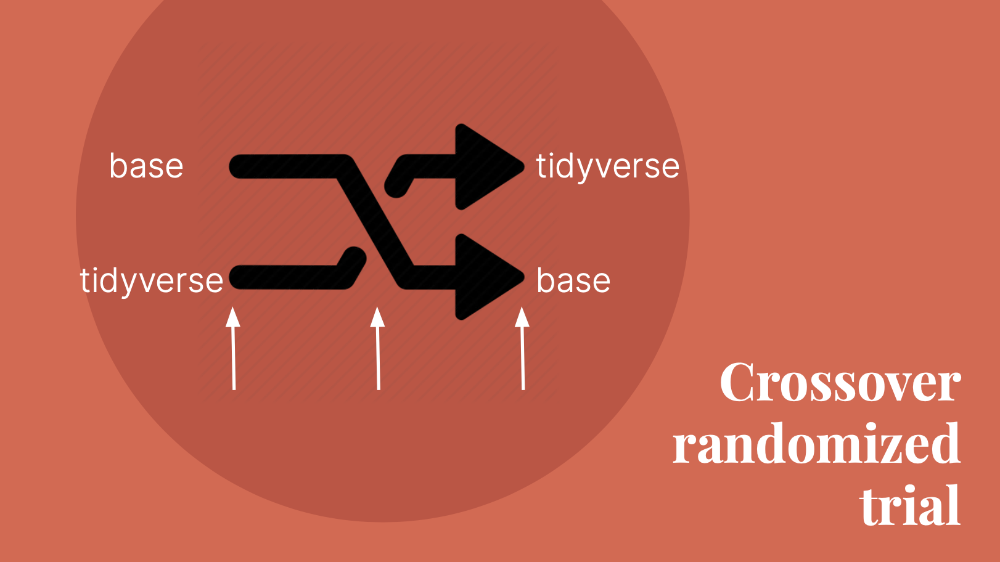
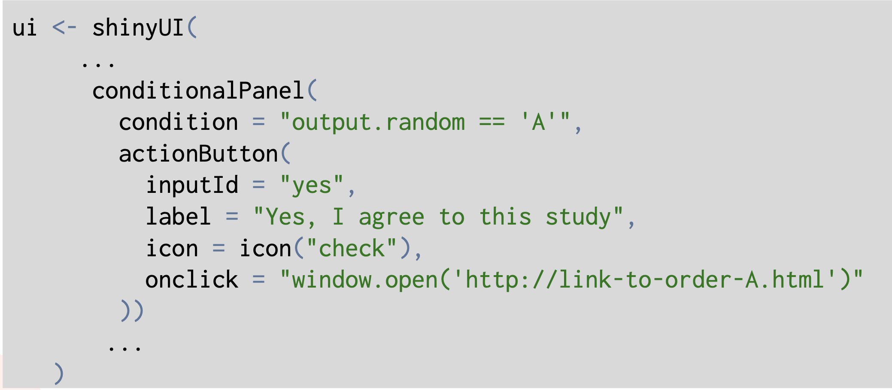

Building Randomization in a shiny application
================

## Rough Draft

When studying the best practices for teaching R, a randomized controlled
trial assesses whether there is a relationship between the order
students learn R tools, and their ability to complete primary data
manipulation tasks. Based on randomization, students learn either
tidyverse or base first and then cross over to learn the other modality.

This study used the Shiny software package to create this cross-random
trial. This package can host a shiny application as a website that runs
R code behind the scenes. For example, the study’s informed consent page
automatically randomizes the participant into the tidyverse first group
or base first group. The random crossover trial was built using the R
Shiny application. A shiny app is a directory structured by two main
functions: a server function and a user interface (UI) function.

The server function is a set of instructions that build the
application’s computational components and run complex R code behind
the scenes. This mechanism provides vast potential for R shiny user
applications and randomization. If input changes, the server will
rebuild each output that depends on it. This dependency chain
dynamically controls the application’s behavior. In this study, the
server function acts as a random number generator to randomize the
participants into groups A or B. The function runs a reactive expression
containing an R statement, which creates a random uniform variable. If
the uniform variable is greater than 0.5, A will be the output;
otherwise, B will be the output. The last line of the function makes
sure that the created random variable will not suspend when hidden.

The UI function is a set of instructions for the webpage’s layout and
appearance; hence, it builds the user-facing side of the application.
The conditional panels allow for a set of elements to dynamically show
or hide, depending on if meeting the given conditions. In this study,
the UI function contains two conditional panels for groups A and B. The
selection control only appears when meeting the requirements. If the
random output is A, then the action button opens a new window to the
shiny app of order A. If the random output is B, then the action button
opens a new window to the shiny app of order B.

With the server function performing the calculations, and the UI
function building the user-facing side of the application, a dynamic and
interactive shiny app solves many statistical problems tied together
with one software mechanism.

McGowan, Lucy D’Agostino. 2020. “Best Practices for Teaching R a
Randomized Controlled Trial.” Presentation. *Lucymcgowan.com/Talks*.
[ocs.google.com/presentation/d/1kOtqXMWhNE6OjInt32PnkBC\_j\_GfVQ-rJKzFxOn29yM/edit?usp=sharing](ocs.google.com/presentation/d/1kOtqXMWhNE6OjInt32PnkBC_j_GfVQ-rJKzFxOn29yM/edit?usp=sharing).

